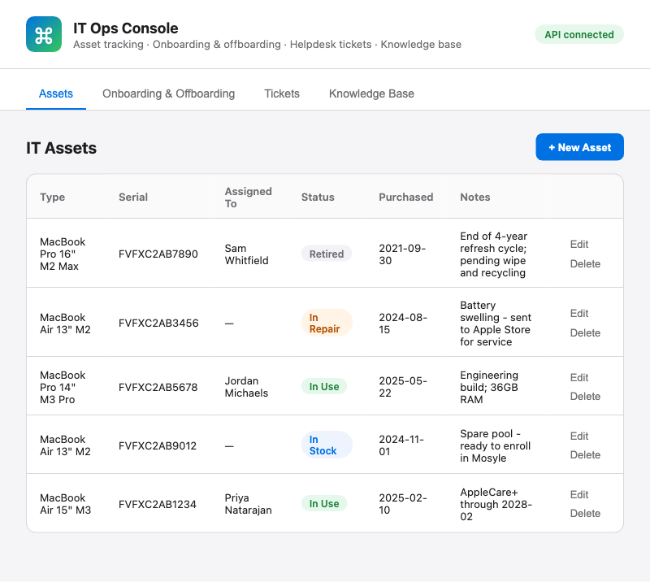

# IT Ops Console



A small internal-tool build I made while prepping for Clockwork's **IT Operations
Specialist** posting (Minneapolis, macOS-based shop, Mosyle MDM, Atlassian
suite, Slack/Teams, 1Password). It's a personal practice/portfolio project,
not a Clockwork product — I built it to get hands-on with the actual duties
in the posting rather than just talk about them.

**Live demo:** https://d198vhce9vcowy.cloudfront.net

## Links (for resume / LinkedIn / cover letter)

- **Live demo:** https://d198vhce9vcowy.cloudfront.net
- **Source code:** https://github.com/bcole84/clockwork-it-ops-console

> Note: the live demo is deployed on-demand (see `scripts/deploy.sh` /
> `scripts/destroy.sh` below) to avoid leaving AWS resources running
> indefinitely. If a link ever comes back unreachable, it just means the
> stack is torn down — redeploying takes a couple of minutes.

## What it does

Four tabs covering three of the role's core duties plus documentation:

| Tab | Job posting duty it demonstrates |
|---|---|
| **Assets** | Track laptops/hardware: type, serial, assigned employee, status (In Stock / In Use / In Repair / Retired), purchase date, notes. → *"Manage IT assets... procure, configure, track, maintain, retire... using MDM"* |
| **Onboarding & Offboarding** | Instantiate a per-employee checklist (Mosyle enrollment, SSO, Slack, Atlassian, 1Password, laptop handoff/return) and check off steps with a live progress bar. → *"Manage employee onboarding and offboarding"* |
| **Tickets** | Submit and triage helpdesk tickets: priority, category, status, requester, resolution notes. → *"Triage requests, troubleshoot problems, resolve support tickets"* |
| **Knowledge Base** | Five playbooks I wrote (new-hire onboarding, offboarding, MDM laptop deployment, ticket triage SOP, macOS network troubleshooting), rendered live in-app from the `/docs` markdown files. → *"Document and share knowledge... playbooks, training materials"* |

## Architecture

```
Browser → CloudFront (PriceClass_100) → S3 (static SPA + docs)
                ↳ fetch() → API Gateway HTTP API (+ shared-secret header) → Lambda × 3 → DynamoDB × 3
```

- **Frontend**: vanilla HTML/CSS/JS, no framework or build step (`frontend/`).
- **API**: API Gateway **HTTP API** (v2) → three Python 3.12 Lambda functions, one per resource (`backend/assets`, `backend/tickets`, `backend/onboarding`), each doing plain CRUD against its own DynamoDB table.
- **Data**: three DynamoDB tables, **provisioned at 1 RCU / 1 WCU each** (3/3 total — inside AWS's *always-free* 25/25 allowance, not just the 12-month one).
- **Auth**: a shared-secret header (`X-Ops-Console-Key`) checked in each Lambda. Lightweight by design — see "What I'd add next" below.
- **IaC**: a single plain CloudFormation template (`infra/template.yaml`), deployed with `aws cloudformation package` + `deploy`.

### Why plain CloudFormation instead of CDK/SAM

The machine I built this on had AWS CLI v2 and Python only — no Node/npm, no
Homebrew, no CDK or SAM CLI. Rather than install a toolchain, I used
CloudFormation directly through the AWS CLI (`cloudformation package` handles
zipping and uploading the local Lambda folders even without the SAM
transform). It's also arguably more transferable for an IT-ops-adjacent role
than a CDK/TypeScript stack would be.

### Cost

Every resource here was chosen to avoid fixed hourly costs (no NAT Gateway, no
VPC, no RDS/ALB) and to fit inside AWS's free tier:

- DynamoDB: 1/1 RCU-WCU × 3 tables — inside the **always-free** 25/25 allowance.
- Lambda, S3, CloudFront: negligible usage at demo volume, well under their free-tier caps.
- API Gateway HTTP API: the one component that's only free for 12 months (1M requests/month) rather than forever — irrelevant at demo scale.

Expected cost for normal use of this project: **$0/month**. Run
`scripts/destroy.sh` when you're done to remove everything and be sure.

## Running it yourself

Requires only the AWS CLI (already configured) and macOS's built-in bash,
`zip`, and `openssl` — nothing else to install.

```bash
scripts/deploy.sh    # packages + deploys the stack, builds and uploads the frontend
scripts/seed.sh      # loads realistic macOS-shop sample data (safe to re-run)
scripts/destroy.sh   # tears everything down (asks for confirmation)
```

`deploy.sh` prints the CloudFront URL and API endpoint when it finishes, and
regenerates the shared secret on every run.

## What I'd add next (kept out of scope on purpose)

- **Cognito-based auth** instead of a shared-secret header, with per-user login for a real multi-user tool.
- **A dedicated IAM deploy user/role** instead of root credentials — fine for a personal sandbox account, not how I'd run this for real.
- **CI/CD** (CodePipeline/CodeBuild) instead of a manual `deploy.sh`.

## Interview talking points

- Chose serverless (Lambda/DynamoDB/API Gateway) — no idle infrastructure, scales to zero, matches the "right-sized solutions" language in Clockwork's own about page.
- Deliberately picked provisioned 1/1 DynamoDB capacity and an HTTP API over on-demand/REST API specifically to land inside AWS's *always-free* tier — a cost-consciousness call, not just a technical one.
- Sample data, the onboarding/offboarding checklist, and the network-troubleshooting playbook are all macOS/Mosyle-specific, mirroring Clockwork's actual environment.
- The Knowledge Base docs aren't filler — they're the same checklists the app enforces, written the way I'd actually want handed to a new IT hire on day one.

---

Built by Bryan Cole as a portfolio/practice project. Not affiliated with or produced by Clockwork.
